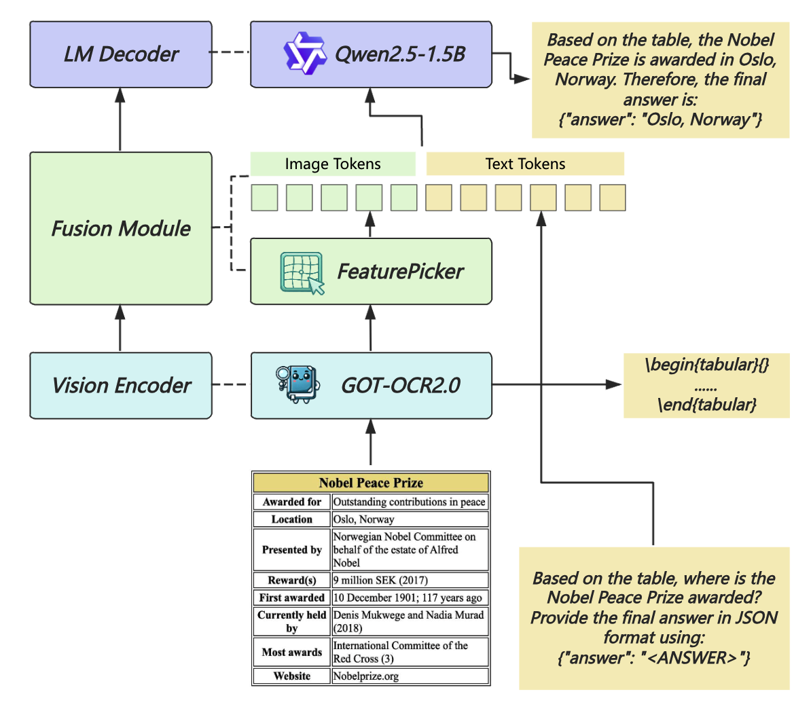
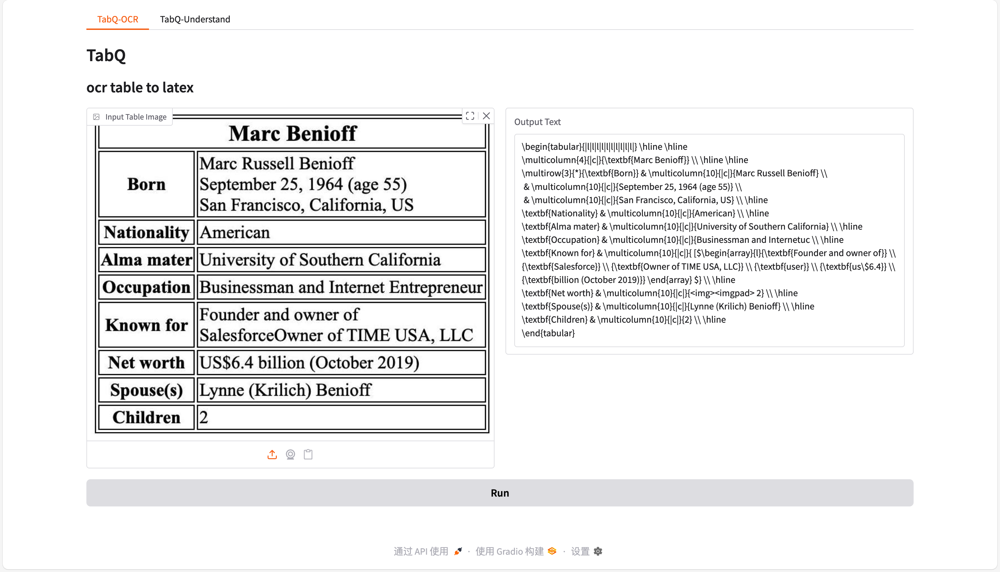
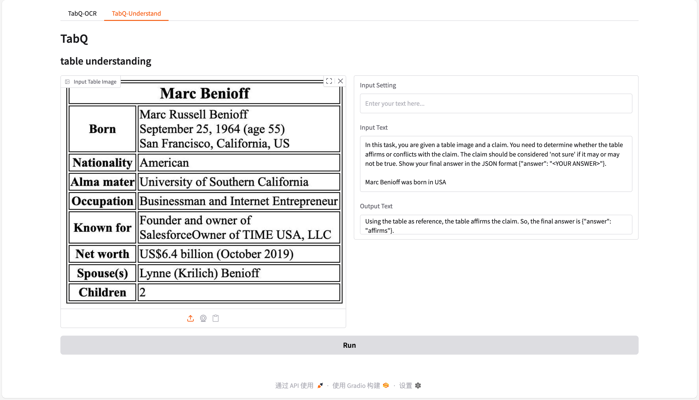

<div align="center">
  
</div>
<div align="center">
  <h1>TabQ</h1>
</div>

## Introduction
TabQ(Tabular Quest) is a multimodal model for table question answering, which is an attempt to use [GOT](https://github.com/Ucas-HaoranWei/GOT-OCR2.0) as a visual encoder in table scenarios.

### Architecture

<div align="center">
    
</div>

### Features
- Use GOT as visual encoder to extract table structure information
- Use Meta-Query to distill image features into a fixed-size sequence, then feed it into LLM
- Isolated design for visual encoder, which can be used to OCR tasks independently

## Installation
```bash
# install uv if you don't have it
# curl -LsSf https://astral.sh/uv/install.sh | sh
uv sync
```

## Weight
download weight from modelscope
```bash
uv tool install modelscope
uvx modelscope download --model 'fivvms/TabQ' --local_dir './weight'

# or if you only want to use the vision encoder to OCR, can exclude the llm weight to save space
# uvx modelscope download --model 'fivvms/TabQ' --local_dir './weight' --exclude 'model-0000*-of-00002.safetensors'
```

## Demo
```bash
bash scripts/ui.sh ./weight
# or if you only want to use the vision encoder to OCR
# bash scripts/ui.sh ./weight ocr
```
if it's successful, you can visit http://localhost:5120, and upload an image to see the result, as shown below:
<div align="center">
    
    
</div>

## Training
### Training Config
```bash
# config for vision encoder
src/config/arguments_ocr.py

# config for llm
src/config/arguments_image.py
```

### Training Script
```bash
# train vision encoder
bash scripts/train.sh src/config/arguments_ocr.py

# train llm
bash scripts/train.sh src/config/arguments_image.py
```